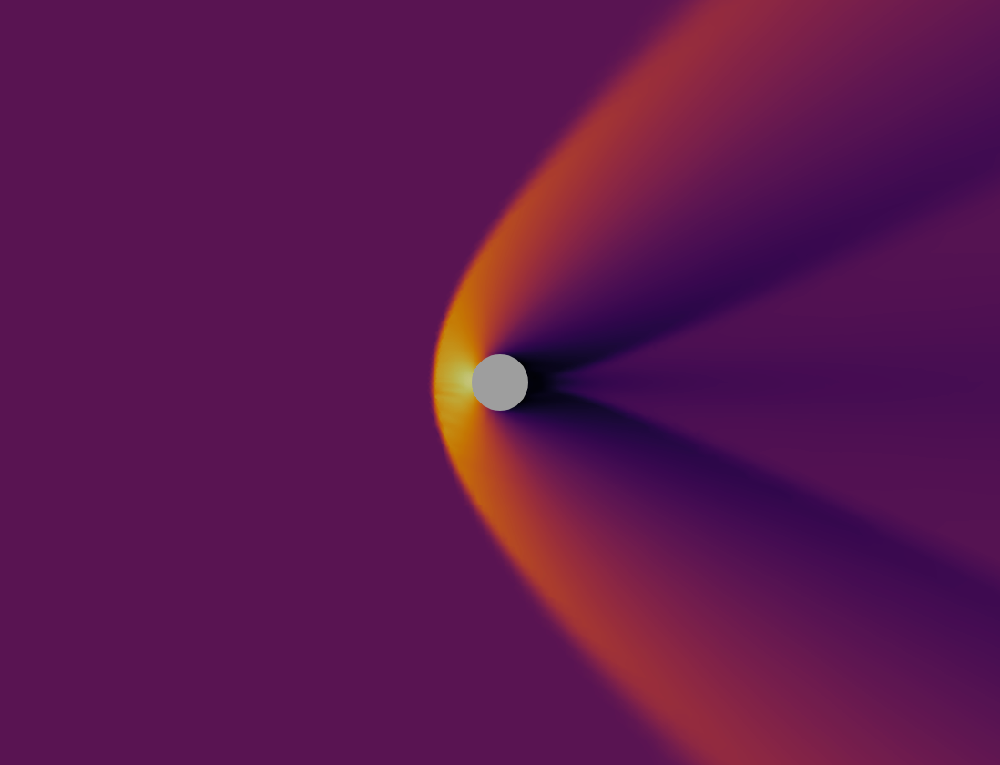

# Euler

Une implémentation minimale d'un solver volume finis pour les équations d'Euler en deux dimensions.




## API Python

Le module inclu un API en Python pour interfacer directement avec le back-end C++. Pour installer le module, on peut utiliser *pip* en exécutant la commande suivante dans le root du module:
```
pip install .
```

Le module peut ensuite être utilisé dans un fichier script Python. Le mesh peut être importé à partir d'un fichier GMSH avec la syntaxe:

```python
import euler

mesh = euler.gmshToFvm(str mesh_file, bool verbose)
```

La prochaine étape est de créer un vecteur de variables pour représenter la solution initiale. Pour cela, on peut utiliser l'object *euler.vectorVar* pour représenter une liste de variables. Les conditions initiales pour un cas uniforme sur tout le domaine peuvent être générées comme:
```python
q_init = euler.var(rho, u, v, p)

init = euler.vectorVar()
for i in range(mesh.size()):
    init.append(q_init)
```

Il reste à définir les constantes du problème, avec la syntaxe:
```python
constants = euler.constants(gamma)
```

On peut ensuite initier le solver en lui passant le mesh, la condition initiale et les constantes. Par exemple, pour un solver Runge-Kutta 5 en régime permanent:
```python
solver = euler.steadyRk5Solver(
    mesh,
    init, 
    constants
)
```

Les propriétés du solver peuvent ensuite être définies. Par exemple:
```python
solver.set_cfl(float cfl)
solver.set_print_interval(int print_interval)
solver.set_tolerance(float tolerance)
solver.set_max_steps(int max_steps)
solver.set_order(int order)
solver.set_smoother(
    str smoother_type, 
    real coefficient, 
    int iterations
)
solver.set_limiter(
    str limiter_type
)
```

Les options d'ordre sont 1 ou 2 seulement. Les deux types de smoothers disponibles sont le smoother explicite ou implicite. Les limiteurs disponibles sont celui de van-leer ou celui de venkatakrishnan.

L'étape suivante est de définir les conditions limites. Pour cela, on utilise la méthode *set_bc()*
```python
solver.set_bc(str field_name, str bc_type, euler.var(rho, u, v, p))
```

Les types de conditions limites disponibles sont *wall* pour représenter un slip wall ou *farfield* pour représenter un farfield.

Finalement, on peut rouler la simulation avec la méthode *simulate()*
```python
solver.simulate(bool verbose)
```

Les résultats peuvent ensuite être exportés dans un fichier *.vtk* avec la méthode *writeVtk()*
```python
solver.writeVtk(str filename)
```


## To do

### Tier 1 - Ordre 1
- [x] Ajouter solver steady et transitoire
- [x] Ajouter un calcul du résidu avec bon scale factor
- [x] Ajouter runge kutta 5
- [x] Ajouter graphique de résidus
- [x] Tester l'ordre du schéma dans un cas avec chocs
- [x] Tester l'ordre du schéma dans un cas sans chocs
- [ ] Ajouter un calcul de forces et coefficients aérodynamiques
- [ ] Obtenir des résultats d'ordre 1 pour divers cas
- [ ] Documenter les équations et méthodes utilisées

### Tier 2 - Ordre 2
- [x] Ajouter calcul des gradients
- [x] Ajouter flux d'ordre 2
- [ ] Tester l'ordre du schéma dans un cas avec chocs
- [ ] Tester l'ordre du schéma dans un cas sans chocs
- [ ] Obtenir des résultats d'ordre 2 pour divers cas
- [ ] Documenter les équations et méthodes utilisées

### Tier 3 - Extras / Performance
- [x] Tester le temps de lecture des mesh
- [ ] Profiler le code et optimiser les éléments plus lents
- [x] Ajouter une sortie format vtk pour visualiser avec Paraview
- [x] Ajouter un API Python
- [x] Ajotuer parallélisation OpenMP
